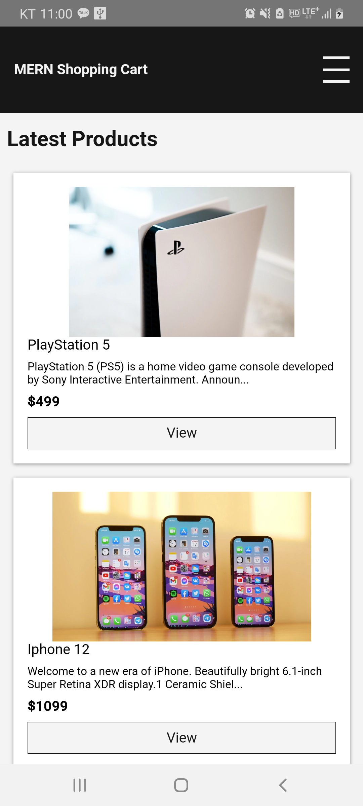

## About Project : MERN Shopping Cart (Mobile APP)

- Run Screen  
<p align="center"></p>  

- I made a mobile application for studying 
  * What I referenced is below
      * Youtube : https://www.youtube.com/watch?v=0divhP3pEsg&t=12327s  
      * Github : https://github.com/LloydJanseVanRensburg/mini-mern-ecommerce-project

- What I used for this project is below  
  * Server : https://github.com/SharkBSJ/bsj_mern_shopping
    * Because this project is Hybrid APP, you need a server (It's made using MERN Stack)
  * React-Native (Client, For Mobile APP)
  * Visual Studio Code (IDE)

- How to build  
  * Please Modify WEB_URL (in ./App.js) as Server Adderess (For Connection)
```
react-native run-android
```

- Thanks a lot
